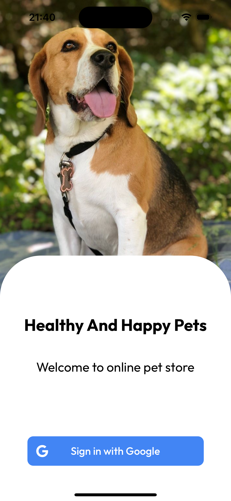
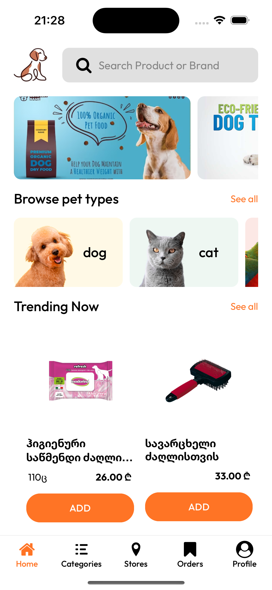
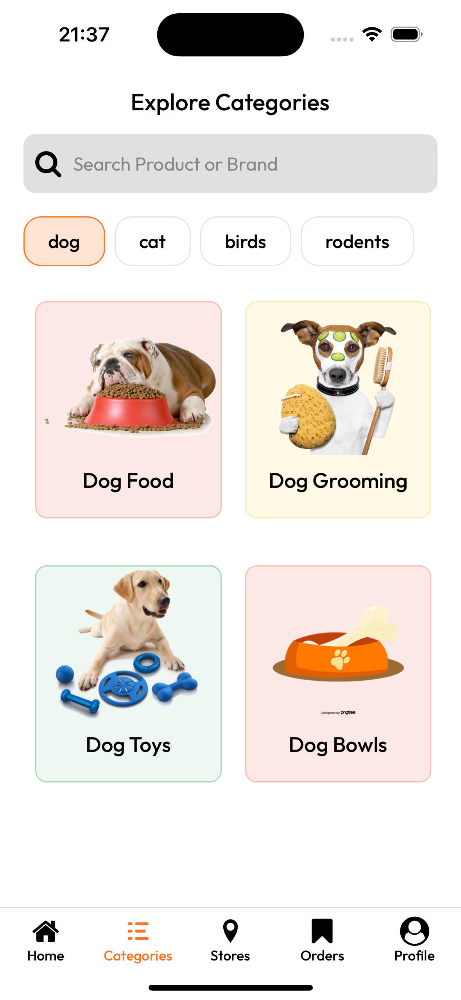
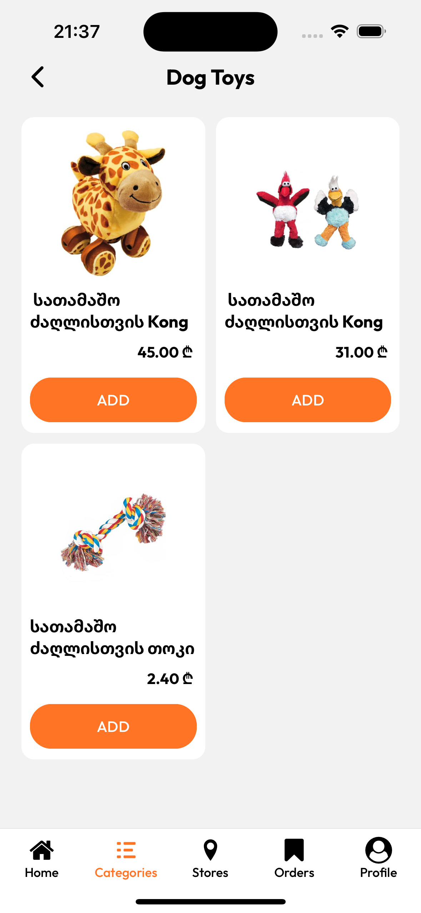
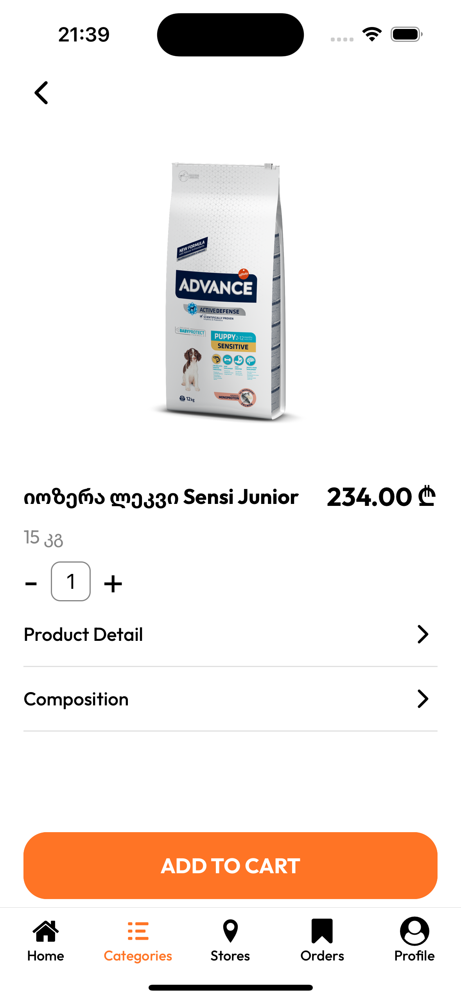
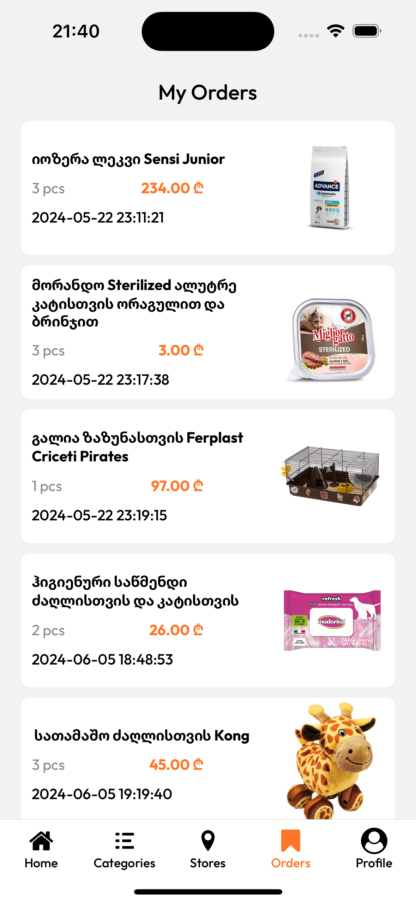
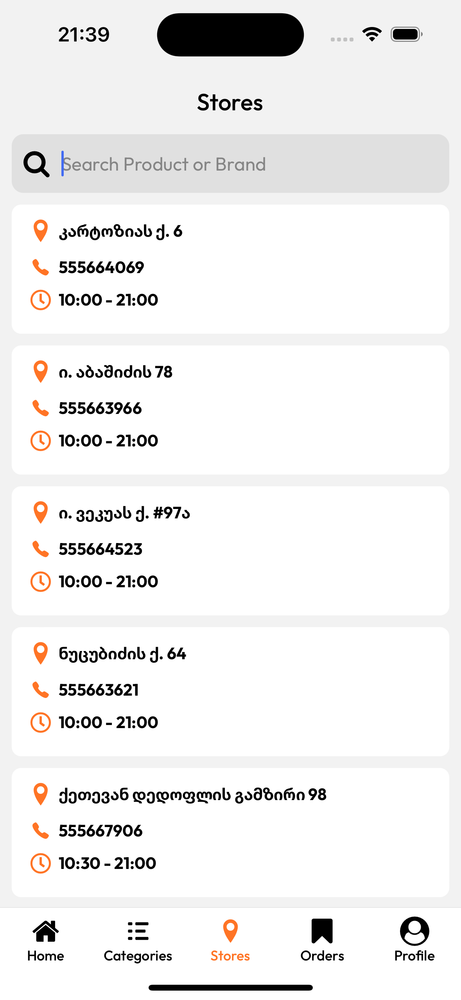

# Petshop App

## Description

This is a Petshop application built with React Native using Expo. The app provides various features to manage and browse through pet-related products and services. This app is designed and developed by me for personal use.

## Features

- Browse and search for pet products and services
- View store details including location, phone, and working hours
- Call stores directly from the app

## GraphQL API

I have created an API using GraphQL for this application. The API allows you to query for stores, products, and other relevant data efficiently. Below are some example queries:

### Example Queries

#### Get Subcategories List

```graphql
query getSubCategories {
    subCategories(where: {category: {name: "`+category+`"}}) {
        name
        id
        image {
            url
        }
        category {
            name
        }
    }
}
```

## Screenshots







